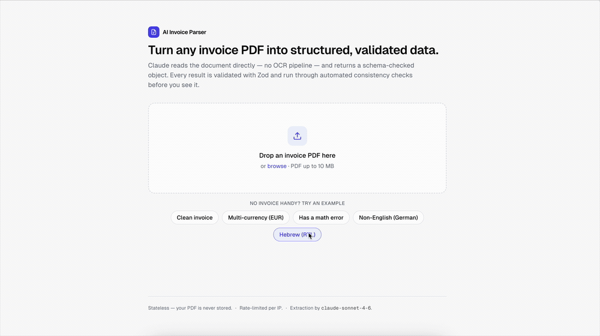

# AI Invoice Parser

Drop a PDF invoice → get back a **schema-validated** structured object plus **automated consistency checks**. Built as a focused demo of shipping production-grade AI: strict typing, runtime validation at every boundary, graceful failure, and an eval harness that proves it survives messy real-world formats — not just one happy-path PDF.

### ▶︎ [Try the live demo →](https://invoice-parser-demo-rho.vercel.app/)

> A deliberately small, finished, deployable MVP. The point isn't feature breadth — it's that the production parts (validation, error handling, rate limiting, evals) are all here and working, which is what separates a toy from something you'd put in front of an AP team.

    



---

## What it does

1. **Upload** a PDF invoice (drag-and-drop) — or click a **"try an example"** button to use one of the bundled sample invoices, so you can demo it with no PDF of your own.
2. The server sends the PDF **directly to Claude** (Sonnet 4.6's document/vision capability — no separate OCR step) with a strict extraction prompt.
3. The model output is constrained by a **JSON schema** at generation time and then **validated with Zod** at the API boundary. If validation fails, the API returns the precise field-level errors instead of crashing or returning garbage.
4. The validated invoice is run through an **anomaly detector**, and the UI shows the structured data (vendor, dates, currency, line-items table, totals) alongside **colored flags** for anything that doesn't reconcile.

### Extraction schema

```ts
{
  vendor:        { name, address?, taxId? },
  invoiceNumber, issueDate, dueDate?, currency,        // currency: 3-letter ISO
  lineItems:     [{ description, qty, unitPrice, amount }],
  subtotal, tax?, total
}
```

The Zod schema in [`lib/schema.ts`](lib/schema.ts) is the **single source of truth** — it is compiled to the JSON Schema handed to the model (`output_config.format`), used to validate the response, and its inferred type flows into the UI and the eval harness. The model and the validator can't drift.

### Anomaly checks

Run after extraction over the validated data (pure functions in [`lib/anomalies.ts`](lib/anomalies.ts), shared with the eval harness):

| Check | Severity |
| --- | --- |
| Line items don't sum to the subtotal (with rounding tolerance) | error |
| Subtotal + tax ≠ total | error |
| Implied tax rate is implausible (negative or > 40%) | warning |
| Due date is earlier than the issue date | error |
| Missing currency / missing total | error |
| Duplicate line items | warning |

Each anomaly carries a stable machine code, a severity, a human-readable message, and a supporting detail line.

---

## Architecture

```
Browser (Next.js App Router, client components)
  │  landing: drag-drop + "try an example"
  │  results: vendor · line-items table · totals · anomaly flags
  │  every failure mode → a distinct, friendly state (never a white screen)
  │
  ▼ POST multipart/form-data
/api/parse  (Node runtime route handler)
  1. Rate-limit by IP (Upstash)  ───────────► 429 with a friendly message
  2. Validate upload (real PDF magic bytes, ≤10 MB) ─► 400
  3. extractInvoice():  Claude (Sonnet 4.6) document block
        + output_config.format = JSON schema (constrains generation)
  4. Zod .safeParse() the model output ──────► 422 with field-level issues
  5. detectAnomalies() over the validated invoice
  6. → { invoice, anomalies, meta }

eval/   (standalone — runs the SAME extract + detect pipeline)
  samples/*.pdf  +  *.expected.json   (ground truth)
  run.ts  →  per-field accuracy + anomaly precision/recall, summary table
```

**Design choices worth calling out:**

- **Validation at every boundary.** The upload is size-capped (a `Content-Length` pre-check before buffering, plus an authoritative post-parse check) and verified by PDF magic bytes — not a trusted `Content-Type`. The model output is never trusted either — it's `safeParse`d, and on failure the API surfaces the exact Zod issues to the UI rather than guessing or 500-ing.
- **Stateless, no database.** The PDF lives only in the request. Nothing is persisted. Deploys to Vercel as-is.
- **Typed wire contract.** [`lib/api-types.ts`](lib/api-types.ts) is imported by both client and server, so a response-shape change is a compile error on both sides.
- **Fails open on rate limiting.** If the Upstash env vars are absent (local dev with no Redis), the limiter logs a warning and allows requests — the app stays fully functional; only the abuse guard is off. Set the two env vars in production and the guard engages (5 requests / 10 min per IP).
- **One shared pipeline.** The eval harness calls the exact same `extractInvoice` + `detectAnomalies` the API route does. The eval measures the real thing, not a reimplementation.

### Tech

Next.js 15 (App Router) · TypeScript (strict, `noUncheckedIndexedAccess`) · Tailwind · `@anthropic-ai/sdk` (`claude-sonnet-4-6`) · Zod + `zod-to-json-schema` · `@upstash/ratelimit` + `@upstash/redis` · `pdf-lib` + `@pdf-lib/fontkit` (sample generation, incl. an embedded Hebrew font for the RTL sample) · `tsx` (eval runner + tests).

The pure logic is unit-tested with Node's built-in test runner (no extra deps): `pnpm test` — 56 tests covering the Zod schema (what's accepted vs rejected), the anomaly detectors, the defensive JSON extraction, the display formatters, and the eval scorer. `pnpm typecheck` runs `tsc --noEmit` under strict mode (`noUnusedLocals` / `noUnusedParameters` catch dead code *within* a file), and `pnpm knip` catches dead code *across* the project — unused exports, files, and dependencies. Three cheap gates, no ESLint config to babysit.

---

## The eval harness

A single demo PDF proves nothing. The `eval/` folder contains **9 sample invoices, each engineered to break the parser in a different way**, with a ground-truth `expected.json` per sample. `pnpm eval` runs every PDF through the live pipeline and reports per-field accuracy and anomaly precision/recall.

| Sample | What it stresses | Expected anomalies |
| --- | --- | --- |
| `clean-acme` | Clean, well-structured baseline | — |
| `multicurrency-eur` | EUR currency, European number format (`1.234,56 €`) | — |
| `math-error` | Line items deliberately don't sum to the subtotal | `line_items_sum_mismatch` |
| `missing-fields` | No tax, no due date, no address (legit absences) | — |
| `non-english-de` | German-language invoice (`Rechnung`, `MwSt.`) | — |
| `non-english-he` | Hebrew right-to-left invoice (ILS, non-Latin script) | — |
| `multipage` | Line items span two pages | — |
| `scanned-look` | Low-contrast, speckled "scanned" render | — |
| `duplicate-lines` | A duplicated charge line | `duplicate_line_items` |

> ### ⚠️ These sample invoices are synthetic
> They are **programmatically generated** ([`eval/render.ts`](eval/render.ts)) to be *adversarial* — varied layouts, number formats, languages, page counts, contrast, and two with intentional defects. They are honestly labeled as synthetic because the eval's job is to prove **"survives varied formats,"** and synthesized invoices give us reliable ground truth to score against. The harness is structured so you can drop **real** (anonymized) invoice PDFs into `eval/samples/` with a matching `expected.json` and score those too — that's the natural next step to make the numbers reflect production traffic.

### Running it

```bash
pnpm eval            # run every sample through the live pipeline (needs ANTHROPIC_API_KEY)
pnpm eval math-error multicurrency-eur   # only the named samples
pnpm eval --dry-run  # validate the harness + corpus WITHOUT calling the API (free)
pnpm eval:gen        # regenerate the sample PDFs + ground truth from eval/samples.ts
```

The runner prints three things: a **per-sample table** (field accuracy + anomaly tp/fp/fn), a **field-level accuracy matrix** (which fields the model nails vs. struggles with, across the whole corpus), and a **summary** (micro field accuracy, anomaly precision / recall / F1). It exits non-zero if any sample hard-fails, so it can gate CI.

A real run also writes **`eval/results.json`**, which the landing page reads and renders as a compact **"proof" badge** (field accuracy + anomaly precision/recall, with the run date and model). The badge hides itself until you've run `pnpm eval` at least once — so commit `eval/results.json` after a run if you want the deployed demo to show your numbers.

```
Summary

  Model                             claude-sonnet-4-6
  Samples run                       9
  Field accuracy (micro)            100%  95/95 fields
  Anomaly precision                 100%
  Anomaly recall                    100%
  Anomaly F1                        100%
```

Real numbers from one `pnpm eval` run (`claude-sonnet-4-6`, committed to `eval/results.json` and shown on the landing badge): every field extracted correctly across all nine formats, every anomaly caught with no false positives.

> Re-run `pnpm eval` any time to refresh the numbers. `pnpm eval --dry-run` scores the ground truth against itself (no API calls), confirming the corpus and scoring are internally consistent before spending a token.

---

## Getting started

### Prerequisites

- Node 20+ and `pnpm`
- An Anthropic API key ([console.anthropic.com](https://console.anthropic.com))
- *(optional)* a Redis database for rate limiting — Upstash, either direct or via the Vercel Marketplace

### Setup

```bash
pnpm install
cp .env.example .env.local      # then fill in ANTHROPIC_API_KEY
pnpm dev                        # http://localhost:3000
```

Environment variables (see [`.env.example`](.env.example)):

| Variable | Required | Purpose |
| --- | --- | --- |
| `ANTHROPIC_API_KEY` | **yes** | Invoice extraction via Claude |
| `UPSTASH_REDIS_REST_URL` / `_TOKEN` | no | Per-IP rate limiting (fails open if unset) |
| `KV_REST_API_URL` / `_TOKEN` | no | Same thing, under the names Vercel's Marketplace Redis injects — accepted as a fallback |

> **"Redis on Vercel" is Upstash via the Marketplace.** Vercel's old first-party KV was deprecated; the Redis option in the dashboard now provisions an Upstash database and injects `KV_REST_API_URL` / `KV_REST_API_TOKEN`. The rate limiter reads either those *or* the `UPSTASH_`-prefixed pair, so it works whether you provision through Vercel's Storage tab or directly at [console.upstash.com](https://console.upstash.com/redis) — no renaming.

### Deploy to Vercel

Push the repo, import it in Vercel, and set `ANTHROPIC_API_KEY` in the project settings. The app is **stateless and needs no database to run** — the `/api/parse` route runs on the Node runtime (it reads raw PDF bytes and calls the Anthropic SDK).

To turn on rate limiting, add Redis from Vercel's **Storage** tab (Marketplace → Upstash) and connect it to the project — Vercel injects `KV_REST_API_URL` / `KV_REST_API_TOKEN` automatically, and the limiter picks them up with no code change. Skip it and the app still works (rate limiting just stays off).

---

## Project layout

```
app/
  page.tsx              landing + results state machine (client)
  api/parse/route.ts    rate-limit → validate → extract → validate → detect
lib/
  schema.ts             Zod schema → JSON Schema + inferred type (source of truth)
  anthropic.ts          system prompt + Claude call + tagged result handling
  anomalies.ts          pure anomaly detectors (shared with eval)
  ratelimit.ts          Upstash limiter (fails open without Redis)
  api-types.ts          typed request/response contract (client + server)
components/             dropzone, result view, anomaly list, error panel
eval/
  samples.ts            declarative corpus + ground truth + expected anomalies
  render.ts             invoice → PDF layout engine (pdf-lib)
  generate-samples.ts   writes PDFs + expected.json (pnpm eval:gen)
  score.ts              per-field + anomaly scoring (pure)
  run.ts                the harness (pnpm eval)
```

---

## Notes & trade-offs

- **Why constrain *and* validate?** `output_config.format` makes the model emit schema-shaped JSON; Zod is the authority that *guarantees* it before any downstream code (or the UI) sees it. Belt and suspenders — the model is steered, the boundary is enforced.
- **Money tolerance.** Floating-point invoice totals accumulate per-line rounding, so the reconciliation checks allow a small tolerance (one cent per line + a relative floor) rather than demanding exact equality.
- **Scanned realism.** The "scanned" sample degrades contrast and adds speckle noise rather than truly rasterizing the page (which would need a headless rendering pipeline). It's a proxy for a non-pristine document, enough to exercise the vision path.
- **What I'd add next:** real (anonymized) invoices in the eval set, citations/bounding-boxes for each extracted field, a confidence signal per field, and batch upload.

---

## Contact

I build production-grade AI features fast — available for freelance / contract work in fintech & AI. If this is the kind of thing you'd want shipped, let's talk.

- **Live demo** — <https://invoice-parser-demo-rho.vercel.app/>
- **GitHub** — [@DylanMerigaud](https://github.com/DylanMerigaud)
- **LinkedIn** — [in/dylanmerigaud](https://www.linkedin.com/in/dylanmerigaud/)
- **Email** — [dylanmerigaud.pro@gmail.com](mailto:dylanmerigaud.pro@gmail.com)

---

## License

[MIT](LICENSE) — use it however you like. The bundled Noto Sans Hebrew font (`eval/fonts/`) is licensed separately under the [SIL Open Font License 1.1](eval/fonts/OFL.txt).

